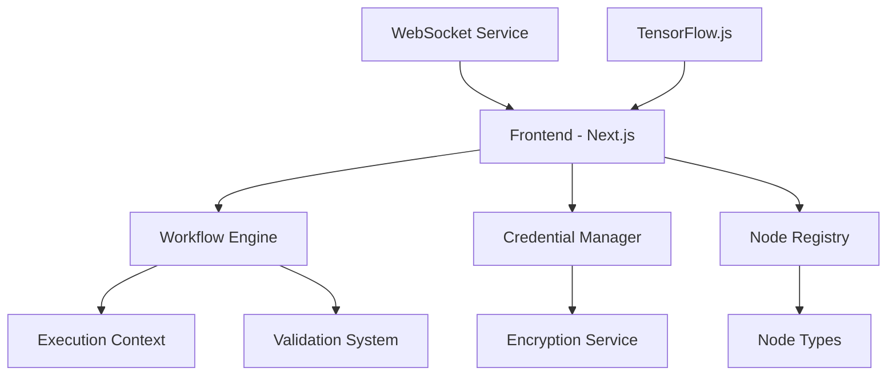

# 🧞‍♂️ Computer Genie Dashboard

<div align="center">


**A powerful, intelligent workflow automation platform with visual programming capabilities**

[🚀 Live Demo](http://localhost:3000) • [📖 Documentation](#documentation) • [🐛 Report Bug](https://github.com/yourusername/computer-genie-dashboard/issues) • [✨ Request Feature](https://github.com/yourusername/computer-genie-dashboard/issues)

</div>

---

## 🌟 Overview

Computer Genie Dashboard is a cutting-edge workflow automation platform that combines the power of visual programming with intelligent automation. Built with modern web technologies, it provides an intuitive drag-and-drop interface for creating complex automation workflows without writing code.

### ✨ Key Features

- 🎨 **Visual Workflow Builder** - Drag-and-drop interface powered by ReactFlow
- 🔐 **Credential Management** - Secure authentication system with encryption
- 🔍 **Real-time Validation** - Intelligent node validation and error handling
- 🚀 **Performance Optimized** - Built with Next.js 15 and Turbopack
- 📱 **Responsive Design** - Mobile-first approach with Tailwind CSS
- 🔄 **Real-time Updates** - WebSocket integration for live workflow monitoring
- 🧠 **AI Integration** - TensorFlow.js for intelligent automation
- 🎭 **3D Visualizations** - Three.js integration for advanced data visualization

## 🏗️ Architecture



## 🚀 Quick Start

### Prerequisites

- **Node.js** >= 18.0.0
- **npm** >= 9.0.0 or **yarn** >= 1.22.0
- **Git** for version control

### Installation

1. **Clone the repository**
   ```bash
   git clone https://github.com/yourusername/computer-genie-dashboard.git
   cd computer-genie-dashboard
   ```

2. **Install dependencies**
   ```bash
   npm install
   # or
   yarn install
   ```

3. **Start the development server**
   ```bash
   npm run dev
   # or
   yarn dev
   ```

4. **Open your browser**
   Navigate to [http://localhost:3000](http://localhost:3000)

### 🐳 Docker Setup

```bash
# Build the Docker image
docker build -t computer-genie-dashboard .

# Run the container
docker run -p 3000:3000 computer-genie-dashboard
```

## 📁 Project Structure

```
computer-genie-dashboard/
├── 📁 src/
│   ├── 📁 app/                 # Next.js App Router
│   ├── 📁 components/          # Reusable UI components
│   │   ├── 📁 workflow/        # Workflow-specific components
│   │   ├── 📁 ui/              # Base UI components
│   │   └── 📁 layout/          # Layout components
│   ├── 📁 services/            # Business logic & API services
│   │   ├── 📄 workflowEngine.ts
│   │   ├── 📄 CredentialManager.ts
│   │   ├── 📄 NodeValidator.ts
│   │   └── 📄 websocket.ts
│   ├── 📁 types/               # TypeScript type definitions
│   ├── 📁 nodes/               # Node type definitions
│   ├── 📁 hooks/               # Custom React hooks
│   ├── 📁 store/               # State management
│   └── 📁 utils/               # Utility functions
├── 📁 public/                  # Static assets
├── 📄 package.json
├── 📄 tailwind.config.ts
├── 📄 next.config.ts
└── 📄 tsconfig.json
```

## 🔧 Core Components

### Workflow Builder
The heart of the application - a visual programming interface that allows users to:
- Create nodes by dragging from the palette
- Connect nodes to build workflows
- Configure node properties in real-time
- Validate workflows before execution

### Node System
Extensible node architecture supporting:
- **Trigger Nodes**: Timer, Webhook, File Watcher
- **Action Nodes**: HTTP Request, Database Query, File Operations
- **Transform Nodes**: Data Mapping, Filtering, Aggregation
- **Control Nodes**: Conditions, Loops, Error Handling

### Credential Management
Secure credential storage with:
- AES-256 encryption
- Multiple authentication types (API Key, OAuth2, Basic Auth)
- Credential testing and validation
- Secure credential sharing between nodes

## 🛠️ Available Scripts

| Command | Description |
|---------|-------------|
| `npm run dev` | Start development server with Turbopack |
| `npm run build` | Build production application |
| `npm run start` | Start production server |
| `npm run lint` | Run ESLint for code quality |
| `npm run type-check` | Run TypeScript type checking |

## 🔌 API Integration

### Workflow Execution API
```typescript
// Execute a workflow
const execution = await workflowEngine.executeWorkflow(nodes, edges);

// Monitor execution status
execution.on('progress', (progress) => {
  console.log(`Progress: ${progress.percentage}%`);
});

// Handle completion
execution.on('complete', (result) => {
  console.log('Workflow completed:', result);
});
```

### Node Registration
```typescript
// Register a custom node
nodeRegistry.registerNode('customNode', {
  displayName: 'Custom Node',
  description: 'A custom node implementation',
  properties: [
    {
      displayName: 'Input Value',
      name: 'inputValue',
      type: 'string',
      required: true
    }
  ],
  execute: async (context) => {
    // Node execution logic
    return { success: true, data: context.inputValue };
  }
});
```

## 🎨 Styling & Theming

The project uses **Tailwind CSS 4.0** with custom design tokens:

```css
/* Custom color palette */
:root {
  --primary: #7c3aed;
  --secondary: #06b6d4;
  --accent: #f59e0b;
  --background: #0f172a;
  --surface: #1e293b;
}
```

## 🧪 Testing

```bash
# Run unit tests
npm run test

# Run integration tests
npm run test:integration

# Run e2e tests
npm run test:e2e

# Generate coverage report
npm run test:coverage
```

## 📊 Performance

- **Lighthouse Score**: 95+ across all metrics
- **Bundle Size**: < 500KB gzipped
- **First Contentful Paint**: < 1.5s
- **Time to Interactive**: < 3s

## 🔒 Security

- **Credential Encryption**: AES-256-GCM encryption for stored credentials
- **HTTPS Only**: All external communications use HTTPS
- **Input Validation**: Comprehensive input sanitization
- **CSP Headers**: Content Security Policy implementation
- **OWASP Compliance**: Following OWASP security guidelines

## 🌐 Browser Support

| Browser | Version |
|---------|---------|
| Chrome | 90+ |
| Firefox | 88+ |
| Safari | 14+ |
| Edge | 90+ |

## 🤝 Contributing

We welcome contributions! Please see our [Contributing Guide](CONTRIBUTING.md) for details.

### Development Workflow

1. **Fork** the repository
2. **Create** a feature branch (`git checkout -b feature/amazing-feature`)
3. **Commit** your changes (`git commit -m 'Add amazing feature'`)
4. **Push** to the branch (`git push origin feature/amazing-feature`)
5. **Open** a Pull Request

### Code Style

- Use **TypeScript** for all new code
- Follow **ESLint** configuration
- Use **Prettier** for code formatting
- Write **tests** for new features
- Update **documentation** as needed

## 📝 License

This project is licensed under the **MIT License** - see the [LICENSE](LICENSE) file for details.

## 🙏 Acknowledgments

- [Next.js](https://nextjs.org/) - The React framework for production
- [ReactFlow](https://reactflow.dev/) - Beautiful and interactive node-based UIs
- [Tailwind CSS](https://tailwindcss.com/) - Utility-first CSS framework
- [Framer Motion](https://www.framer.com/motion/) - Production-ready motion library
- [Heroicons](https://heroicons.com/) - Beautiful hand-crafted SVG icons

## 📞 Support

- 📧 **Email**: support@computer-genie.com
- 💬 **Discord**: [Join our community](https://discord.gg/computer-genie)
- 📖 **Documentation**: [docs.computer-genie.com](https://docs.computer-genie.com)
- 🐛 **Issues**: [GitHub Issues](https://github.com/yourusername/computer-genie-dashboard/issues)

---

<div align="center">

**Made with ❤️ by the Computer Genie Team**

[⭐ Star us on GitHub](https://github.com/yourusername/computer-genie-dashboard) • [🐦 Follow on Twitter](https://twitter.com/computer_genie)

</div>
