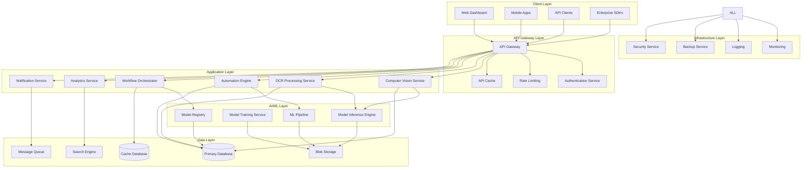
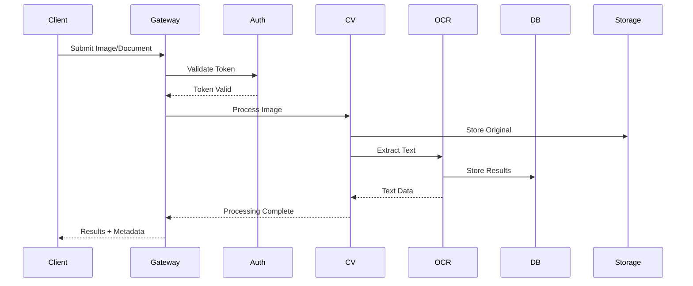
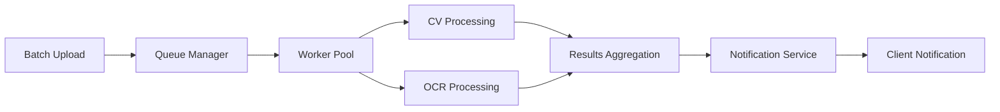
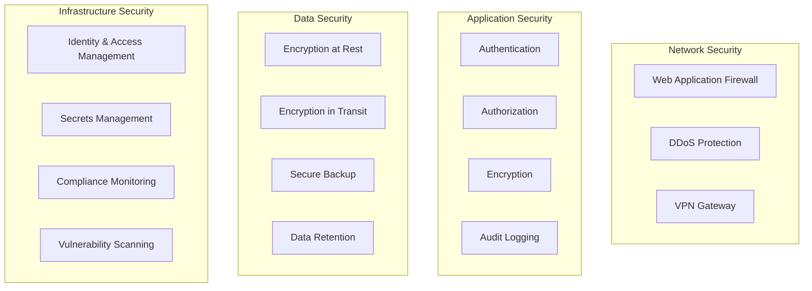
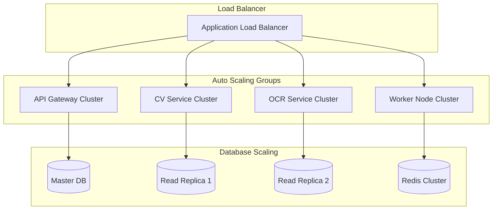
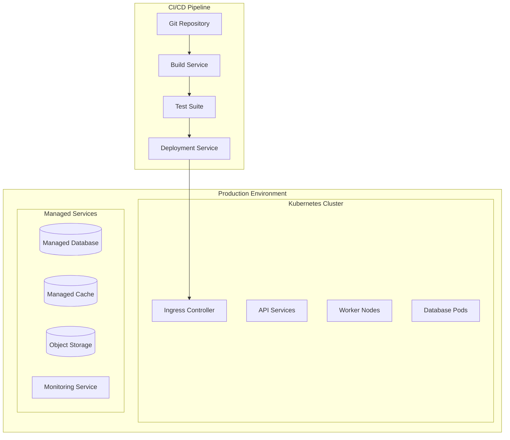

# 🏗️ Computer Genie Enterprise Architecture

**Scalable, Secure, and High-Performance Enterprise Platform**

---

## 📋 **Table of Contents**

1. [System Overview](#system-overview)
2. [Core Architecture](#core-architecture)
3. [Component Details](#component-details)
4. [Data Flow](#data-flow)
5. [Security Architecture](#security-architecture)
6. [Scalability & Performance](#scalability--performance)
7. [Integration Patterns](#integration-patterns)
8. [Deployment Architecture](#deployment-architecture)

---

## 🎯 **System Overview**

Computer Genie Enterprise is built on a modern, cloud-native architecture designed for:
- **High Availability**: 99.99% uptime SLA
- **Horizontal Scalability**: Auto-scaling based on demand
- **Security First**: Zero-trust security model
- **Performance**: Sub-second response times
- **Flexibility**: Multi-cloud and hybrid deployment support

### **Architecture Principles**
- 🔄 **Microservices**: Loosely coupled, independently deployable services
- 🛡️ **Security by Design**: Built-in security at every layer
- 📈 **Elastic Scaling**: Dynamic resource allocation
- 🔧 **API-First**: Everything accessible via APIs
- 📊 **Observability**: Comprehensive monitoring and logging

---

## 🏗️ **Core Architecture**

### **High-Level Architecture Diagram**

---

## 🔧 **Component Details**

### **🌐 API Gateway Layer**

#### **API Gateway**
- **Technology**: Kong Enterprise / AWS API Gateway
- **Features**: 
  - Request routing and load balancing
  - Protocol translation (HTTP/HTTPS/WebSocket)
  - Request/response transformation
  - Circuit breaker pattern implementation
- **Performance**: 10,000+ requests/second per instance
- **Availability**: Active-active deployment across multiple AZs

#### **Authentication Service**
- **Technology**: Keycloak / Auth0 Enterprise
- **Protocols**: OAuth 2.0, SAML 2.0, OpenID Connect
- **Features**:
  - Multi-factor authentication (MFA)
  - Single Sign-On (SSO)
  - Role-based access control (RBAC)
  - Session management
- **Integration**: LDAP, Active Directory, external IdPs

### **🤖 Application Services**

#### **Computer Vision Service**
- **Technology**: Python, FastAPI, OpenCV, TensorFlow
- **Capabilities**:
  - Image preprocessing and enhancement
  - Object detection and recognition
  - Image classification and analysis
  - Custom model inference
- **Performance**: 100ms average processing time
- **Scalability**: Auto-scaling based on queue depth

#### **OCR Processing Service**
- **Technology**: Tesseract, PaddleOCR, Custom ML models
- **Features**:
  - Multi-language text extraction
  - Handwriting recognition
  - Document structure analysis
  - Confidence scoring
- **Accuracy**: 99.5% for printed text, 95% for handwriting
- **Throughput**: 1000 documents/minute per instance

#### **Automation Engine**
- **Technology**: Python, Celery, Redis
- **Capabilities**:
  - Workflow execution
  - Task scheduling
  - Error handling and retry logic
  - State management
- **Reliability**: 99.9% task completion rate
- **Concurrency**: 10,000 concurrent tasks

#### **Workflow Orchestrator**
- **Technology**: Apache Airflow / Temporal
- **Features**:
  - Visual workflow designer
  - Conditional logic and branching
  - Human-in-the-loop tasks
  - Workflow versioning
- **Scalability**: Distributed execution across multiple workers

### **🧠 AI/ML Layer**

#### **Model Inference Engine**
- **Technology**: TensorFlow Serving, PyTorch Serve, ONNX Runtime
- **Features**:
  - Multi-model serving
  - A/B testing capabilities
  - Model versioning
  - Performance optimization
- **Performance**: <50ms inference time
- **Throughput**: 10,000 inferences/second

#### **Model Training Service**
- **Technology**: Kubeflow, MLflow
- **Capabilities**:
  - Automated model training
  - Hyperparameter optimization
  - Model validation and testing
  - Continuous learning
- **Infrastructure**: GPU-accelerated training clusters

### **💾 Data Layer**

#### **Primary Database**
- **Technology**: PostgreSQL 14+ with read replicas
- **Features**:
  - ACID compliance
  - Point-in-time recovery
  - Automated backups
  - Connection pooling
- **Performance**: 10,000 IOPS, <5ms query response
- **Availability**: Multi-AZ deployment with automatic failover

#### **Cache Database**
- **Technology**: Redis Cluster
- **Use Cases**:
  - Session storage
  - API response caching
  - Real-time analytics
  - Message queuing
- **Performance**: <1ms response time
- **Capacity**: 100GB+ in-memory storage

#### **Blob Storage**
- **Technology**: AWS S3 / Azure Blob / GCS
- **Features**:
  - Versioning and lifecycle management
  - Server-side encryption
  - Cross-region replication
  - CDN integration
- **Capacity**: Unlimited scalability
- **Durability**: 99.999999999% (11 9's)

---

## 🔄 **Data Flow**

### **Typical Processing Flow**

### **Batch Processing Flow**

---

## 🛡️ **Security Architecture**

### **Security Layers**

### **Security Features**

#### **🔐 Authentication & Authorization**
- **Multi-Factor Authentication**: TOTP, SMS, Hardware tokens
- **Single Sign-On**: SAML 2.0, OpenID Connect
- **Role-Based Access Control**: Granular permissions
- **API Key Management**: Rotating keys with expiration

#### **🔒 Data Protection**
- **Encryption at Rest**: AES-256 encryption
- **Encryption in Transit**: TLS 1.3
- **Key Management**: Hardware Security Modules (HSM)
- **Data Masking**: PII protection in non-production environments

#### **📊 Monitoring & Compliance**
- **Audit Logging**: Comprehensive activity logs
- **Compliance**: SOC 2, GDPR, HIPAA, ISO 27001
- **Vulnerability Management**: Regular security assessments
- **Incident Response**: 24/7 security operations center

---

## 📈 **Scalability & Performance**

### **Horizontal Scaling**

### **Performance Metrics**

| Component | Metric | Target | Monitoring |
|-----------|--------|--------|------------|
| API Gateway | Response Time | <100ms | Real-time |
| CV Service | Processing Time | <500ms | Real-time |
| OCR Service | Accuracy | >99% | Batch |
| Database | Query Time | <10ms | Real-time |
| Storage | Upload Speed | >100MB/s | Real-time |

### **Auto-Scaling Policies**
- **CPU Utilization**: Scale out at 70%, scale in at 30%
- **Memory Usage**: Scale out at 80%, scale in at 40%
- **Queue Depth**: Scale out at 100 messages, scale in at 10
- **Response Time**: Scale out if >200ms for 5 minutes

---

## 🔌 **Integration Patterns**

### **API Integration**
- **REST APIs**: RESTful services with OpenAPI 3.0 specification
- **GraphQL**: Flexible data querying for complex use cases
- **Webhooks**: Real-time event notifications
- **Streaming**: WebSocket connections for real-time updates

### **Enterprise System Integration**
- **ERP Systems**: SAP, Oracle, Microsoft Dynamics
- **CRM Systems**: Salesforce, HubSpot, Microsoft CRM
- **Document Management**: SharePoint, Box, Dropbox
- **Workflow Systems**: ServiceNow, Jira, Asana

### **Message Patterns**
- **Request-Response**: Synchronous API calls
- **Publish-Subscribe**: Event-driven architecture
- **Message Queues**: Asynchronous task processing
- **Event Streaming**: Real-time data processing

---

## 🚀 **Deployment Architecture**

### **Cloud-Native Deployment**

### **Multi-Environment Strategy**
- **Development**: Feature development and testing
- **Staging**: Pre-production validation
- **Production**: Live customer environment
- **DR**: Disaster recovery environment

### **Infrastructure as Code**
- **Terraform**: Infrastructure provisioning
- **Helm Charts**: Kubernetes application deployment
- **Ansible**: Configuration management
- **GitOps**: Declarative deployment workflows

---

## 📊 **Monitoring & Observability**

### **Monitoring Stack**
- **Metrics**: Prometheus + Grafana
- **Logging**: ELK Stack (Elasticsearch, Logstash, Kibana)
- **Tracing**: Jaeger distributed tracing
- **APM**: Application Performance Monitoring

### **Key Metrics**
- **Business Metrics**: Processing volume, accuracy rates, user satisfaction
- **Technical Metrics**: Response times, error rates, resource utilization
- **Security Metrics**: Failed login attempts, API abuse, data access patterns

### **Alerting**
- **Critical Alerts**: Immediate notification (PagerDuty)
- **Warning Alerts**: Email notifications
- **Info Alerts**: Dashboard notifications
- **SLA Monitoring**: Automated SLA breach detection

---

## 📞 **Support & Maintenance**

### **24/7 Support**
- **Tier 1**: Basic troubleshooting and user support
- **Tier 2**: Technical issue resolution
- **Tier 3**: Engineering escalation
- **Emergency**: Critical system issues

### **Maintenance Windows**
- **Scheduled**: Monthly maintenance windows
- **Emergency**: As-needed critical updates
- **Zero-Downtime**: Rolling updates for non-breaking changes

---

**For detailed implementation guidance, contact our Enterprise Architecture team:**

📧 **Email**: architecture@abhishektech.com  
📞 **Phone**: +91-XXX-XXX-XXXX  
🌐 **Documentation**: [docs.abhishektech.com](https://docs.abhishektech.com)

---

**© 2024 Abhishek Technologies Pvt Ltd. All rights reserved.**