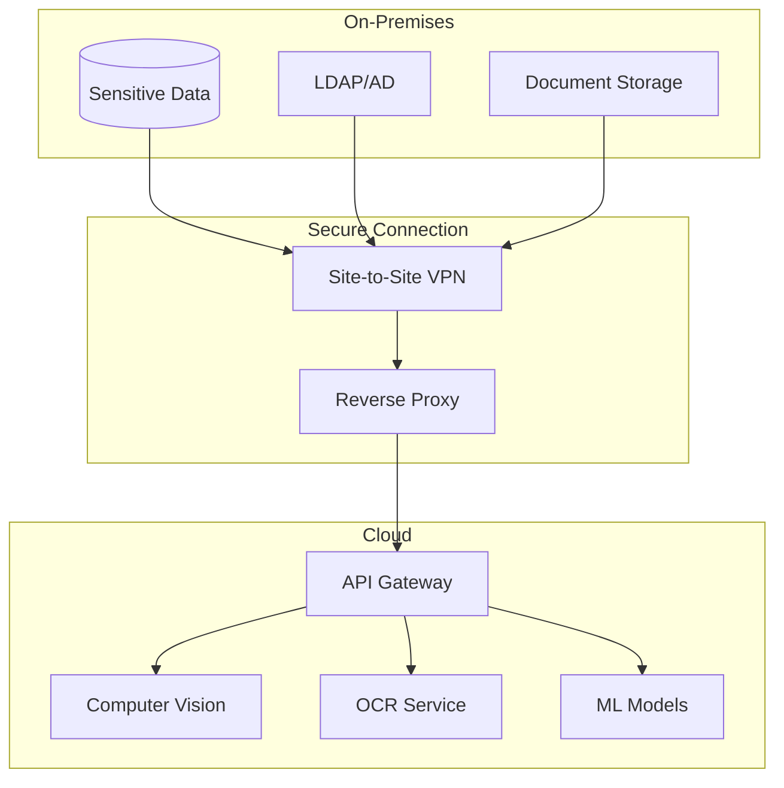

# 🚀 Computer Genie Enterprise Deployment Guide

<div align="center">


**Production-Ready Deployment for Enterprise Environments**

</div>

---

## 📋 **Table of Contents**

1. [Prerequisites](#prerequisites)
2. [Deployment Options](#deployment-options)
3. [Cloud Deployment](#cloud-deployment)
4. [On-Premises Deployment](#on-premises-deployment)
5. [Hybrid Deployment](#hybrid-deployment)
6. [Configuration Management](#configuration-management)
7. [Security Setup](#security-setup)
8. [Monitoring & Logging](#monitoring--logging)
9. [Backup & Recovery](#backup--recovery)
10. [Troubleshooting](#troubleshooting)

---

## ✅ **Prerequisites**

### **Infrastructure Requirements**

#### **Minimum System Requirements**
- **CPU**: 16 cores (Intel Xeon or AMD EPYC)
- **RAM**: 64GB DDR4
- **Storage**: 1TB NVMe SSD (primary) + 10TB HDD (data)
- **Network**: 10Gbps network interface
- **GPU**: NVIDIA Tesla V100 or equivalent (for AI workloads)

#### **Recommended System Requirements**
- **CPU**: 32 cores (Intel Xeon Platinum or AMD EPYC)
- **RAM**: 128GB DDR4
- **Storage**: 2TB NVMe SSD (primary) + 50TB SSD (data)
- **Network**: 25Gbps network interface
- **GPU**: NVIDIA A100 or equivalent

### **Software Prerequisites**

#### **Operating System**
- **Linux**: Ubuntu 20.04 LTS, RHEL 8+, CentOS 8+
- **Container Runtime**: Docker 20.10+, containerd 1.4+
- **Orchestration**: Kubernetes 1.21+

#### **Database Requirements**
- **Primary Database**: PostgreSQL 13+
- **Cache Database**: Redis 6.0+
- **Search Engine**: Elasticsearch 7.10+
- **Message Queue**: RabbitMQ 3.8+ or Apache Kafka 2.8+

#### **Security Requirements**
- **TLS Certificates**: Valid SSL/TLS certificates
- **Secrets Management**: HashiCorp Vault or AWS Secrets Manager
- **Identity Provider**: LDAP, Active Directory, or SAML 2.0 IdP

---

## 🎯 **Deployment Options**

### **1. 🌩️ Cloud-Native Deployment**
- **Best For**: Scalability, managed services, global reach
- **Platforms**: AWS, Azure, Google Cloud Platform
- **Benefits**: Auto-scaling, managed databases, global CDN
- **Estimated Cost**: $5,000-$50,000/month

### **2. 🏢 On-Premises Deployment**
- **Best For**: Data sovereignty, compliance, existing infrastructure
- **Requirements**: Private data center or colocation
- **Benefits**: Full control, data residency, customization
- **Estimated Cost**: $100,000-$500,000 initial + $10,000/month

### **3. 🔄 Hybrid Deployment**
- **Best For**: Gradual migration, compliance requirements
- **Architecture**: Critical data on-premises, processing in cloud
- **Benefits**: Flexibility, risk mitigation, cost optimization
- **Estimated Cost**: $15,000-$75,000/month

### **4. 🏭 Multi-Cloud Deployment**
- **Best For**: Vendor independence, disaster recovery
- **Strategy**: Primary cloud + secondary cloud for DR
- **Benefits**: Avoid vendor lock-in, enhanced reliability
- **Estimated Cost**: $10,000-$100,000/month

---

## ☁️ **Cloud Deployment**

### **AWS Deployment**

#### **Architecture Overview**
```yaml
# AWS Infrastructure Components
VPC:
  - Public Subnets: ALB, NAT Gateway
  - Private Subnets: EKS Nodes, RDS
  - Database Subnets: RDS Multi-AZ

EKS Cluster:
  - Node Groups: m5.2xlarge (auto-scaling)
  - GPU Nodes: p3.2xlarge (AI workloads)
  - Spot Instances: Cost optimization

Managed Services:
  - RDS PostgreSQL: Multi-AZ deployment
  - ElastiCache Redis: Cluster mode
  - S3: Document storage
  - CloudFront: Global CDN
```

#### **Step-by-Step AWS Deployment**

**1. Infrastructure Setup**
```bash
# Clone deployment repository
git clone https://github.com/abhishektech/computer-genie-enterprise.git
cd computer-genie-enterprise/deployments/aws

# Configure AWS CLI
aws configure

# Deploy infrastructure with Terraform
terraform init
terraform plan -var-file="production.tfvars"
terraform apply
```

**2. EKS Cluster Setup**
```bash
# Update kubeconfig
aws eks update-kubeconfig --region us-west-2 --name computer-genie-prod

# Install required operators
kubectl apply -f https://raw.githubusercontent.com/kubernetes/ingress-nginx/main/deploy/static/provider/aws/deploy.yaml

# Install cert-manager for TLS
kubectl apply -f https://github.com/jetstack/cert-manager/releases/download/v1.7.1/cert-manager.yaml
```

**3. Application Deployment**
```bash
# Deploy using Helm
helm repo add computer-genie https://charts.abhishektech.com
helm repo update

# Install Computer Genie Enterprise
helm install computer-genie computer-genie/enterprise \
  --namespace computer-genie \
  --create-namespace \
  --values production-values.yaml
```

#### **Production Values Configuration**
```yaml
# production-values.yaml
global:
  environment: production
  domain: computer-genie.yourcompany.com
  
api:
  replicaCount: 3
  resources:
    requests:
      cpu: 2
      memory: 4Gi
    limits:
      cpu: 4
      memory: 8Gi

computerVision:
  replicaCount: 5
  gpu:
    enabled: true
    type: nvidia-tesla-v100
  resources:
    requests:
      nvidia.com/gpu: 1
      cpu: 4
      memory: 16Gi

database:
  external: true
  host: computer-genie-prod.cluster-xxx.us-west-2.rds.amazonaws.com
  port: 5432
  name: computer_genie_prod

redis:
  external: true
  host: computer-genie-prod.xxx.cache.amazonaws.com
  port: 6379

storage:
  type: s3
  bucket: computer-genie-prod-documents
  region: us-west-2

monitoring:
  prometheus:
    enabled: true
  grafana:
    enabled: true
  alertmanager:
    enabled: true
```

### **Azure Deployment**

#### **Architecture Overview**
```yaml
# Azure Infrastructure Components
Resource Group: computer-genie-prod-rg
Virtual Network: computer-genie-vnet
Subnets:
  - aks-subnet: AKS cluster nodes
  - db-subnet: Azure Database for PostgreSQL
  - storage-subnet: Storage accounts

AKS Cluster:
  - System Node Pool: Standard_D4s_v3
  - User Node Pool: Standard_D8s_v3 (auto-scaling)
  - GPU Node Pool: Standard_NC6s_v3

Managed Services:
  - Azure Database for PostgreSQL: Flexible Server
  - Azure Cache for Redis: Premium tier
  - Azure Blob Storage: Hot tier
  - Azure CDN: Standard Microsoft
```

#### **Azure Deployment Commands**
```bash
# Login to Azure
az login

# Create resource group
az group create --name computer-genie-prod-rg --location eastus

# Deploy infrastructure
az deployment group create \
  --resource-group computer-genie-prod-rg \
  --template-file azure-infrastructure.json \
  --parameters @azure-parameters.json

# Get AKS credentials
az aks get-credentials --resource-group computer-genie-prod-rg --name computer-genie-aks

# Deploy application
helm install computer-genie computer-genie/enterprise \
  --namespace computer-genie \
  --create-namespace \
  --values azure-production-values.yaml
```

### **Google Cloud Platform Deployment**

#### **GCP Deployment Commands**
```bash
# Authenticate with GCP
gcloud auth login
gcloud config set project computer-genie-prod

# Create GKE cluster
gcloud container clusters create computer-genie-cluster \
  --zone us-central1-a \
  --num-nodes 3 \
  --machine-type n1-standard-4 \
  --enable-autoscaling \
  --min-nodes 1 \
  --max-nodes 10

# Get cluster credentials
gcloud container clusters get-credentials computer-genie-cluster --zone us-central1-a

# Deploy application
helm install computer-genie computer-genie/enterprise \
  --namespace computer-genie \
  --create-namespace \
  --values gcp-production-values.yaml
```

---

## 🏢 **On-Premises Deployment**

### **Infrastructure Setup**

#### **Hardware Configuration**
```yaml
# Recommended Hardware Layout
Load Balancer Tier:
  - 2x HAProxy servers (active-passive)
  - 16 cores, 32GB RAM each

Application Tier:
  - 6x Application servers
  - 32 cores, 64GB RAM each
  - 1TB NVMe SSD each

Database Tier:
  - 3x Database servers (primary + 2 replicas)
  - 32 cores, 128GB RAM each
  - 2TB NVMe SSD + 10TB HDD each

Storage Tier:
  - Distributed storage cluster (Ceph/GlusterFS)
  - 10x Storage nodes
  - 16 cores, 64GB RAM each
  - 50TB storage each
```

#### **Network Configuration**
```yaml
# Network Topology
Management Network: 10.0.1.0/24
Application Network: 10.0.2.0/24
Database Network: 10.0.3.0/24
Storage Network: 10.0.4.0/24

VLANs:
  - VLAN 10: Management
  - VLAN 20: Application
  - VLAN 30: Database
  - VLAN 40: Storage

Firewall Rules:
  - Allow HTTPS (443) from internet to load balancers
  - Allow application traffic between tiers
  - Deny direct database access from internet
  - Allow monitoring traffic from management network
```

### **Kubernetes On-Premises Setup**

#### **1. Prepare Nodes**
```bash
# On all nodes - disable swap
sudo swapoff -a
sudo sed -i '/ swap / s/^\(.*\)$/#\1/g' /etc/fstab

# Install container runtime
curl -fsSL https://download.docker.com/linux/ubuntu/gpg | sudo apt-key add -
sudo add-apt-repository "deb [arch=amd64] https://download.docker.com/linux/ubuntu $(lsb_release -cs) stable"
sudo apt-get update
sudo apt-get install -y docker-ce docker-ce-cli containerd.io

# Install kubeadm, kubelet, kubectl
curl -s https://packages.cloud.google.com/apt/doc/apt-key.gpg | sudo apt-key add -
echo "deb https://apt.kubernetes.io/ kubernetes-xenial main" | sudo tee /etc/apt/sources.list.d/kubernetes.list
sudo apt-get update
sudo apt-get install -y kubelet kubeadm kubectl
sudo apt-mark hold kubelet kubeadm kubectl
```

#### **2. Initialize Master Node**
```bash
# Initialize cluster
sudo kubeadm init --pod-network-cidr=10.244.0.0/16 --apiserver-advertise-address=<MASTER_IP>

# Configure kubectl
mkdir -p $HOME/.kube
sudo cp -i /etc/kubernetes/admin.conf $HOME/.kube/config
sudo chown $(id -u):$(id -g) $HOME/.kube/config

# Install network plugin (Flannel)
kubectl apply -f https://raw.githubusercontent.com/coreos/flannel/master/Documentation/kube-flannel.yml
```

#### **3. Join Worker Nodes**
```bash
# On worker nodes - join cluster
sudo kubeadm join <MASTER_IP>:6443 --token <TOKEN> --discovery-token-ca-cert-hash sha256:<HASH>
```

#### **4. Install Storage Class**
```yaml
# local-storage-class.yaml
apiVersion: storage.k8s.io/v1
kind: StorageClass
metadata:
  name: local-storage
provisioner: kubernetes.io/no-provisioner
volumeBindingMode: WaitForFirstConsumer
---
apiVersion: v1
kind: PersistentVolume
metadata:
  name: computer-genie-pv
spec:
  capacity:
    storage: 1Ti
  accessModes:
  - ReadWriteOnce
  persistentVolumeReclaimPolicy: Retain
  storageClassName: local-storage
  local:
    path: /mnt/computer-genie-data
  nodeAffinity:
    required:
      nodeSelectorTerms:
      - matchExpressions:
        - key: kubernetes.io/hostname
          operator: In
          values:
          - storage-node-1
```

### **Database Setup**

#### **PostgreSQL High Availability**
```bash
# Install PostgreSQL on primary server
sudo apt-get install -y postgresql-13 postgresql-contrib-13

# Configure primary server
sudo -u postgres psql -c "CREATE USER computer_genie WITH PASSWORD 'secure_password';"
sudo -u postgres psql -c "CREATE DATABASE computer_genie_prod OWNER computer_genie;"

# Configure replication
echo "wal_level = replica" >> /etc/postgresql/13/main/postgresql.conf
echo "max_wal_senders = 3" >> /etc/postgresql/13/main/postgresql.conf
echo "wal_keep_segments = 64" >> /etc/postgresql/13/main/postgresql.conf

# Configure pg_hba.conf for replication
echo "host replication replicator <REPLICA_IP>/32 md5" >> /etc/postgresql/13/main/pg_hba.conf

# Restart PostgreSQL
sudo systemctl restart postgresql
```

#### **Redis Cluster Setup**
```bash
# Install Redis on all nodes
sudo apt-get install -y redis-server

# Configure Redis cluster
redis-cli --cluster create \
  10.0.3.10:6379 10.0.3.11:6379 10.0.3.12:6379 \
  10.0.3.13:6379 10.0.3.14:6379 10.0.3.15:6379 \
  --cluster-replicas 1
```

---

## 🔄 **Hybrid Deployment**

### **Architecture Overview**


### **Hybrid Configuration**
```yaml
# hybrid-values.yaml
global:
  deployment: hybrid
  
database:
  external: true
  host: on-premises-db.company.local
  port: 5432
  ssl: true
  tunnel:
    enabled: true
    endpoint: vpn-gateway.company.local

storage:
  type: hybrid
  sensitive:
    type: on-premises
    path: /mnt/sensitive-docs
  processed:
    type: s3
    bucket: computer-genie-processed

authentication:
  type: ldap
  host: ldap.company.local
  port: 636
  ssl: true
  baseDN: "dc=company,dc=local"
```

---

## ⚙️ **Configuration Management**

### **Environment Configuration**
```yaml
# config/production.yaml
environment: production
debug: false

api:
  host: 0.0.0.0
  port: 8080
  workers: 4
  timeout: 300

database:
  host: ${DB_HOST}
  port: ${DB_PORT}
  name: ${DB_NAME}
  user: ${DB_USER}
  password: ${DB_PASSWORD}
  pool_size: 20
  max_overflow: 30

redis:
  host: ${REDIS_HOST}
  port: ${REDIS_PORT}
  password: ${REDIS_PASSWORD}
  db: 0
  pool_size: 10

storage:
  type: ${STORAGE_TYPE}
  bucket: ${STORAGE_BUCKET}
  region: ${STORAGE_REGION}
  access_key: ${STORAGE_ACCESS_KEY}
  secret_key: ${STORAGE_SECRET_KEY}

ai_models:
  computer_vision:
    model_path: /models/cv/latest
    batch_size: 32
    gpu_enabled: true
  ocr:
    model_path: /models/ocr/latest
    languages: ["en", "es", "fr", "de"]

logging:
  level: INFO
  format: json
  output: stdout

monitoring:
  prometheus:
    enabled: true
    port: 9090
  jaeger:
    enabled: true
    endpoint: http://jaeger:14268/api/traces
```

### **Secrets Management**
```bash
# Using Kubernetes secrets
kubectl create secret generic computer-genie-secrets \
  --from-literal=db-password=secure_password \
  --from-literal=redis-password=redis_password \
  --from-literal=jwt-secret=jwt_secret_key \
  --from-literal=storage-access-key=access_key \
  --from-literal=storage-secret-key=secret_key

# Using HashiCorp Vault
vault kv put secret/computer-genie/prod \
  db_password=secure_password \
  redis_password=redis_password \
  jwt_secret=jwt_secret_key
```

---

## 🛡️ **Security Setup**

### **TLS/SSL Configuration**
```yaml
# tls-config.yaml
apiVersion: v1
kind: Secret
metadata:
  name: computer-genie-tls
  namespace: computer-genie
type: kubernetes.io/tls
data:
  tls.crt: <base64-encoded-certificate>
  tls.key: <base64-encoded-private-key>
---
apiVersion: networking.k8s.io/v1
kind: Ingress
metadata:
  name: computer-genie-ingress
  annotations:
    kubernetes.io/ingress.class: nginx
    cert-manager.io/cluster-issuer: letsencrypt-prod
spec:
  tls:
  - hosts:
    - api.computer-genie.company.com
    secretName: computer-genie-tls
  rules:
  - host: api.computer-genie.company.com
    http:
      paths:
      - path: /
        pathType: Prefix
        backend:
          service:
            name: computer-genie-api
            port:
              number: 80
```

### **Network Policies**
```yaml
# network-policy.yaml
apiVersion: networking.k8s.io/v1
kind: NetworkPolicy
metadata:
  name: computer-genie-network-policy
  namespace: computer-genie
spec:
  podSelector:
    matchLabels:
      app: computer-genie
  policyTypes:
  - Ingress
  - Egress
  ingress:
  - from:
    - namespaceSelector:
        matchLabels:
          name: ingress-nginx
    ports:
    - protocol: TCP
      port: 8080
  egress:
  - to:
    - namespaceSelector:
        matchLabels:
          name: database
    ports:
    - protocol: TCP
      port: 5432
  - to:
    - namespaceSelector:
        matchLabels:
          name: redis
    ports:
    - protocol: TCP
      port: 6379
```

---

## 📊 **Monitoring & Logging**

### **Prometheus Configuration**
```yaml
# prometheus-config.yaml
global:
  scrape_interval: 15s
  evaluation_interval: 15s

rule_files:
  - "computer_genie_rules.yml"

scrape_configs:
  - job_name: 'computer-genie-api'
    static_configs:
      - targets: ['computer-genie-api:8080']
    metrics_path: /metrics
    scrape_interval: 10s

  - job_name: 'computer-genie-cv'
    static_configs:
      - targets: ['computer-genie-cv:8081']
    metrics_path: /metrics
    scrape_interval: 10s

alerting:
  alertmanagers:
    - static_configs:
        - targets:
          - alertmanager:9093
```

### **Grafana Dashboards**
```json
{
  "dashboard": {
    "title": "Computer Genie Enterprise Dashboard",
    "panels": [
      {
        "title": "API Response Time",
        "type": "graph",
        "targets": [
          {
            "expr": "histogram_quantile(0.95, rate(http_request_duration_seconds_bucket[5m]))",
            "legendFormat": "95th percentile"
          }
        ]
      },
      {
        "title": "Processing Volume",
        "type": "stat",
        "targets": [
          {
            "expr": "rate(computer_genie_documents_processed_total[5m])",
            "legendFormat": "Documents/sec"
          }
        ]
      }
    ]
  }
}
```

### **Log Aggregation**
```yaml
# fluentd-config.yaml
apiVersion: v1
kind: ConfigMap
metadata:
  name: fluentd-config
data:
  fluent.conf: |
    <source>
      @type tail
      path /var/log/containers/computer-genie*.log
      pos_file /var/log/fluentd-computer-genie.log.pos
      tag kubernetes.computer-genie
      format json
    </source>
    
    <match kubernetes.computer-genie>
      @type elasticsearch
      host elasticsearch.logging.svc.cluster.local
      port 9200
      index_name computer-genie-logs
      type_name _doc
    </match>
```

---

## 💾 **Backup & Recovery**

### **Database Backup Strategy**
```bash
#!/bin/bash
# backup-database.sh

# Configuration
DB_HOST="computer-genie-db.company.local"
DB_NAME="computer_genie_prod"
DB_USER="backup_user"
BACKUP_DIR="/backups/database"
RETENTION_DAYS=30

# Create backup
TIMESTAMP=$(date +%Y%m%d_%H%M%S)
BACKUP_FILE="${BACKUP_DIR}/computer_genie_${TIMESTAMP}.sql"

pg_dump -h $DB_HOST -U $DB_USER -d $DB_NAME > $BACKUP_FILE

# Compress backup
gzip $BACKUP_FILE

# Upload to cloud storage
aws s3 cp ${BACKUP_FILE}.gz s3://computer-genie-backups/database/

# Clean old backups
find $BACKUP_DIR -name "*.sql.gz" -mtime +$RETENTION_DAYS -delete

echo "Backup completed: ${BACKUP_FILE}.gz"
```

### **Application Data Backup**
```yaml
# backup-cronjob.yaml
apiVersion: batch/v1
kind: CronJob
metadata:
  name: computer-genie-backup
spec:
  schedule: "0 2 * * *"  # Daily at 2 AM
  jobTemplate:
    spec:
      template:
        spec:
          containers:
          - name: backup
            image: computer-genie/backup:latest
            env:
            - name: BACKUP_TYPE
              value: "full"
            - name: S3_BUCKET
              value: "computer-genie-backups"
            volumeMounts:
            - name: data-volume
              mountPath: /data
          volumes:
          - name: data-volume
            persistentVolumeClaim:
              claimName: computer-genie-data
          restartPolicy: OnFailure
```

### **Disaster Recovery Plan**
```yaml
# Disaster Recovery Procedures

RTO (Recovery Time Objective): 4 hours
RPO (Recovery Point Objective): 1 hour

Recovery Steps:
1. Assess damage and determine recovery scope
2. Provision new infrastructure (if needed)
3. Restore database from latest backup
4. Restore application data from backup
5. Deploy application using latest configuration
6. Verify system functionality
7. Update DNS to point to new environment
8. Monitor system performance

Backup Locations:
- Primary: AWS S3 (us-west-2)
- Secondary: Azure Blob Storage (eastus)
- Tertiary: On-premises backup server

Testing Schedule:
- Monthly: Backup restoration test
- Quarterly: Full disaster recovery drill
- Annually: Complete infrastructure rebuild test
```

---

## 🔧 **Troubleshooting**

### **Common Issues & Solutions**

#### **1. Pod Startup Issues**
```bash
# Check pod status
kubectl get pods -n computer-genie

# Describe problematic pod
kubectl describe pod <pod-name> -n computer-genie

# Check logs
kubectl logs <pod-name> -n computer-genie --previous

# Common solutions:
# - Check resource limits
# - Verify secrets and configmaps
# - Check image pull policies
# - Validate network policies
```

#### **2. Database Connection Issues**
```bash
# Test database connectivity
kubectl run -it --rm debug --image=postgres:13 --restart=Never -- \
  psql -h computer-genie-db -U computer_genie -d computer_genie_prod

# Check database logs
kubectl logs -f deployment/postgresql -n database

# Verify network policies
kubectl get networkpolicy -n computer-genie
```

#### **3. Performance Issues**
```bash
# Check resource utilization
kubectl top nodes
kubectl top pods -n computer-genie

# Check HPA status
kubectl get hpa -n computer-genie

# Review metrics in Grafana
# - API response times
# - Database query performance
# - Memory and CPU usage
# - Network throughput
```

#### **4. Storage Issues**
```bash
# Check PVC status
kubectl get pvc -n computer-genie

# Check storage class
kubectl get storageclass

# Verify volume mounts
kubectl describe pod <pod-name> -n computer-genie
```

### **Emergency Contacts**
- **24/7 Support**: +91-XXX-XXX-XXXX
- **Emergency Email**: emergency@abhishektech.com
- **Slack Channel**: #computer-genie-support
- **Escalation Manager**: escalation@abhishektech.com

### **Support Tiers**
- **Tier 1**: Basic troubleshooting (Response: 15 minutes)
- **Tier 2**: Technical issues (Response: 1 hour)
- **Tier 3**: Engineering escalation (Response: 4 hours)
- **Emergency**: Critical system down (Response: Immediate)

---

## 📞 **Professional Services**

### **Deployment Services**
- **Architecture Review**: $10,000
- **Deployment Planning**: $15,000
- **Implementation**: $50,000-$200,000
- **Migration Services**: $25,000-$100,000
- **Training**: $5,000 per session

### **Ongoing Support**
- **Basic Support**: $5,000/month
- **Premium Support**: $15,000/month
- **Enterprise Support**: $25,000/month
- **Dedicated Support**: $50,000/month

### **Contact Information**
📧 **Email**: deployment@abhishektech.com  
📞 **Phone**: +91-XXX-XXX-XXXX  
🌐 **Website**: [abhishektech.com/deployment](https://abhishektech.com/deployment)  
📅 **Schedule Consultation**: [calendly.com/abhishektech-deployment](https://calendly.com/abhishektech-deployment)

---

**© 2024 Abhishek Technologies Pvt Ltd. All rights reserved.**