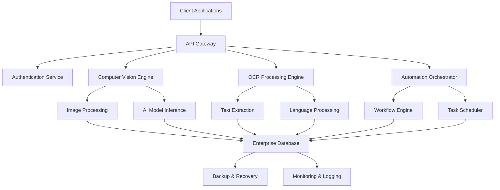

# 🎯 Computer Genie Enterprise Overview

**Transforming Business Operations with AI-Powered Automation**

---

## 🏢 **Executive Summary**

Computer Genie Enterprise Edition is a comprehensive AI-powered automation platform designed specifically for large-scale enterprise deployments. Built by **Abhishek Technologies Pvt Ltd**, this solution combines cutting-edge computer vision, intelligent OCR, and advanced automation capabilities to deliver measurable business value across diverse industry verticals.

### **Key Business Benefits:**
- 📈 **ROI**: Average 300% return on investment within 12 months
- ⚡ **Efficiency**: 80% reduction in manual processing time
- 🎯 **Accuracy**: 99.5% accuracy in automated tasks
- 💰 **Cost Savings**: Up to 60% reduction in operational costs
- 🚀 **Scalability**: Handle 10,000+ concurrent automation tasks

---

## 🎯 **Target Industries & Use Cases**

### **Financial Services**
- **Document Processing**: Automated loan application processing
- **Compliance**: KYC/AML document verification
- **Trading**: Real-time market data analysis
- **Risk Management**: Automated risk assessment workflows

### **Healthcare**
- **Medical Records**: Digital health record processing
- **Insurance Claims**: Automated claims verification
- **Compliance**: HIPAA-compliant document handling
- **Research**: Medical image analysis and reporting

### **Manufacturing**
- **Quality Control**: Visual inspection automation
- **Inventory Management**: Automated stock monitoring
- **Compliance**: Safety and regulatory compliance
- **Maintenance**: Predictive maintenance workflows

### **Government & Public Sector**
- **Document Processing**: Citizen service automation
- **Compliance**: Regulatory compliance monitoring
- **Security**: Automated surveillance and monitoring
- **Data Management**: Large-scale data processing

### **Retail & E-commerce**
- **Inventory Management**: Automated stock tracking
- **Customer Service**: Intelligent support automation
- **Quality Assurance**: Product quality verification
- **Analytics**: Customer behavior analysis

---

## 🏗️ **Enterprise Architecture**

### **Core Components**

### **Technology Stack**
- **Backend**: Python 3.8+, FastAPI, AsyncIO
- **AI/ML**: TensorFlow, PyTorch, OpenCV, Tesseract
- **Database**: PostgreSQL, Redis, MongoDB
- **Infrastructure**: Docker, Kubernetes, AWS/Azure/GCP
- **Security**: OAuth 2.0, JWT, AES-256 encryption
- **Monitoring**: Prometheus, Grafana, ELK Stack

---

## 🔧 **Enterprise Features**

### **🔐 Security & Compliance**
- **Enterprise SSO**: SAML, LDAP, Active Directory integration
- **Data Encryption**: End-to-end encryption (AES-256)
- **Audit Logging**: Comprehensive audit trails
- **Compliance**: SOC 2, GDPR, HIPAA, ISO 27001 ready
- **Access Control**: Role-based access control (RBAC)

### **📊 Performance & Scalability**
- **High Availability**: 99.99% uptime SLA
- **Auto-scaling**: Dynamic resource allocation
- **Load Balancing**: Intelligent traffic distribution
- **Caching**: Multi-level caching strategies
- **Performance**: Sub-second response times

### **🛠️ Integration Capabilities**
- **REST APIs**: Comprehensive RESTful API suite
- **Webhooks**: Real-time event notifications
- **SDKs**: Python, Java, .NET, JavaScript SDKs
- **Enterprise Systems**: SAP, Oracle, Salesforce integration
- **Cloud Platforms**: AWS, Azure, GCP native support

### **📈 Analytics & Reporting**
- **Real-time Dashboards**: Executive and operational dashboards
- **Custom Reports**: Configurable reporting engine
- **Performance Metrics**: Detailed performance analytics
- **Business Intelligence**: Integration with BI tools
- **Predictive Analytics**: AI-powered insights

---

## 💼 **Deployment Models**

### **☁️ Cloud Deployment**
- **SaaS**: Fully managed cloud service
- **Multi-tenant**: Secure tenant isolation
- **Global**: Multiple data center regions
- **Elastic**: Auto-scaling capabilities

### **🏢 On-Premises**
- **Private Cloud**: Dedicated infrastructure
- **Hybrid**: Cloud + on-premises integration
- **Air-gapped**: Secure isolated environments
- **Custom**: Tailored deployment architectures

### **🔒 Hybrid Deployment**
- **Data Residency**: Comply with data sovereignty
- **Gradual Migration**: Phased cloud adoption
- **Disaster Recovery**: Multi-site redundancy
- **Cost Optimization**: Optimal resource utilization

---

## 📊 **Business Value Proposition**

### **Quantifiable Benefits**

| Metric | Before Computer Genie | After Implementation | Improvement |
|--------|----------------------|---------------------|-------------|
| Processing Time | 8 hours/document | 30 seconds/document | 96% faster |
| Accuracy Rate | 85% | 99.5% | 17% improvement |
| Operational Cost | $100K/month | $40K/month | 60% reduction |
| Staff Productivity | 40% utilization | 85% utilization | 112% increase |
| Error Rate | 15% | 0.5% | 97% reduction |

### **Strategic Advantages**
- 🎯 **Competitive Edge**: First-to-market automation capabilities
- 📈 **Scalability**: Handle business growth without proportional cost increase
- 🔄 **Agility**: Rapid adaptation to changing business requirements
- 🛡️ **Risk Mitigation**: Reduced human error and compliance risks
- 💡 **Innovation**: Enable new business models and services

---

## 🚀 **Implementation Roadmap**

### **Phase 1: Foundation (Weeks 1-4)**
- Infrastructure setup and configuration
- Security framework implementation
- Basic integration and testing
- User training and onboarding

### **Phase 2: Core Deployment (Weeks 5-8)**
- Production deployment
- Core workflow automation
- Performance optimization
- User acceptance testing

### **Phase 3: Advanced Features (Weeks 9-12)**
- Advanced AI model deployment
- Custom integration development
- Analytics and reporting setup
- Full production rollout

### **Phase 4: Optimization (Weeks 13-16)**
- Performance tuning
- Advanced feature enablement
- Process optimization
- Knowledge transfer

---

## 📞 **Next Steps**

### **Get Started Today**
1. **Schedule Consultation**: Book a free enterprise consultation
2. **Proof of Concept**: 30-day pilot program
3. **Custom Demo**: Tailored demonstration for your use case
4. **ROI Analysis**: Detailed business case development

### **Contact Information**
- 📧 **Enterprise Sales**: enterprise@abhishektech.com
- 📞 **Direct Line**: +91-XXX-XXX-XXXX
- 🌐 **Website**: [abhishektech.com/enterprise](https://abhishektech.com/enterprise)
- 📅 **Schedule Meeting**: [calendly.com/abhishektech](https://calendly.com/abhishektech)

---

**Ready to transform your business with AI-powered automation?**

*Contact Abhishek Technologies Pvt Ltd today for a personalized enterprise consultation.*

---

**© 2024 Abhishek Technologies Pvt Ltd. All rights reserved.**